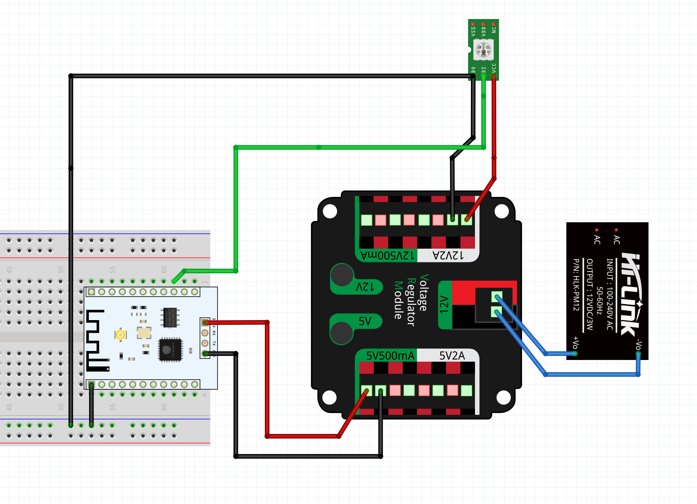

# ESP8266_Wifi_Lantern

Arduino based ESP8266 + WS2812 (Neopixel) lighting control for dynamic lighting via WiFi.
 
## Installation
 
### Pre-requisites
 
The first dependency to install is the Arduino IDE. This can be accomplished by downloading the program directly from the Arduino website: [https://www.arduino.cc/en/software](https://www.arduino.cc/en/software) for the relevant platform. 

On Debian GNU Linux or a Debian based linux distribution, you can use the `apt` command:

```
$ sudo apt install arduino
```
 
Run the arduino program from the command line:

```
$ arduino
```

or directly from the operating system.

In the Arduino IDE, inside `File/Preferences/Additional Boards Manager URLs` input, add the `https://arduino.esp8266.com/stable/package_esp8266com_index.json` URL.

#### ESP8266 board manager library

Restart the Arduino IDE and from the `Tools/Boards/Board Manager` window add the `esp8266` board library.

#### FastLED library

From `Tools/Manage Libraries` add the `FastLED` library.
 
 
### Arduino ESP8266 code

Clone this repo with `git clone https://github.com/ishiki-lab/ESP8266_Wifi_Lantern.git` or [download the zip file](https://github.com/ishiki-lab/ESP8266_Wifi_Lantern/archive/refs/heads/main.zip) and extract it.

Connect the ESP8266 using a USB mini cable.

In the Arduino IDE, select the relevant ESP8266 board from the `Tools/Board` menu. 

In the Arduino IDE, press the upload button to upload the code to the device.

## Use

Connect the ESP8266 and WS2812 components as shown in the diagram below:



Connect to the `lantern` SSID (or the name of the SSID you have chosen in the code) and input the chosen password.

The default IP address of the device acting as a Wi-Fi access point is `192.168.4.1`.

Input this IP address into a browser and enjoy playing with the light!


